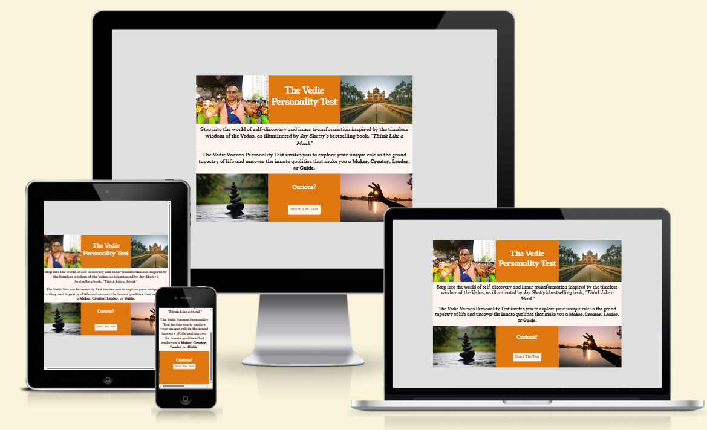

# The Vedic Personality Test

[The Vedic Personality Test](https://ijokpy.github.io/personality-test/index.html) is entertaining test to discover your personality type based on Vedic categories.

This [application](https://ijokpy.github.io/personality-test/index.html) is built as a milestone Project#2 for Code Institute Full Stack Software Development course. The [application](https://ijokpy.github.io/personality-test/index.html) is built using HTML,CSS and JavaScript Technologies.

# UX Design

## User stories

### As a user
- I want to be entertained
- I want to easy understand the navigation
- I want to repeat or come back later

## Structure

### Homepage
- Instruct the user what this test is about
- Invites the user to start the test
  

## Quiz area
- Alows the user to select prefered option and navigate to next question
- Progress guides the user where they are in this test

## Design
- The design is simple and not overloaded

## Colour Scheme
![assets/images/colour_palette.webp]

# Technologies

- HTML, CSS and JavaScript for code development
- IDE in [Codeanywhere](https://app.codeanywhere.com/) to develop a code
- [GiHub](https://github.com/) to store the code and control version
- [Google Fonts](https://fonts.google.com/?preview.text=Welcome%20to%20the%20club&preview.text_type=custom&query=quick) to download required style
- [Favicon.cc](https://www.favicon.cc/) to create the website favicon
- [FontAwesome](https://fontawesome.com/) to use multiple different icons
- [Convertio.co](https://convertio.co/download/eb3ecdaee00a5454d0ad83152d3a29ff55ea90/) to convert .png images to .webp
- [Pexels.com](https://www.pexels.com/) to download free images
- [Pixabay.com](https://pixabay.com/) to download free images
- [Freepik.com](https://www.freepik.com/) to download free images
- [Designevo.com](https://www.designevo.com/) to design logo
- [W3C HTML Validator](https://validator.w3.org/#validate_by_input) to validate HTML code
- [W3C CSS Validator (Jigsaw)](https://jigsaw.w3.org/css-validator/) to validate CSS code
- [MyColor.space](https://mycolor.space/) to generate color pallette for the website

### Testing

- The manual testing involved launching the website in Chrome, FireFox, Safari
- The website is responsive
- Confirmed that Logo and navigation tabs are visible and are responsive

## Bugs

## Validation Testing

- HTML validation via [W3 Markup](https://validator.w3.org/) complete, no errors or warning detected.
- CSS validation via [Jigsaw](https://jigsaw.w3.org/css-validator/) complete, no errors detected.
- Accessibility validation via [Google Lighthouse](https://developers.google.com/web/tools/lighthouse)

### Deployment

This project was deployed to GitHub pages. The steps to deploy are as follows:

1. Launch GitHub and log in.
2. Navigate to Repositories section and select `soloverse-book-club`.
3. Select `Settings` and under `General` section, select `main` as default branch.
4. Then navigate to `Pages` under `Code and automation` section.
5. Confirm that under `Source` `Branch` is showing `main` and `/(root)`.
6. Press `Save`.
7. Click on the [link](https://ijokpy.github.io/personality-test/index.html) next to `Visit Site` to launch the website.

## Content

## Media

### Credits

-Thank you CodeInstitute for available resources.
